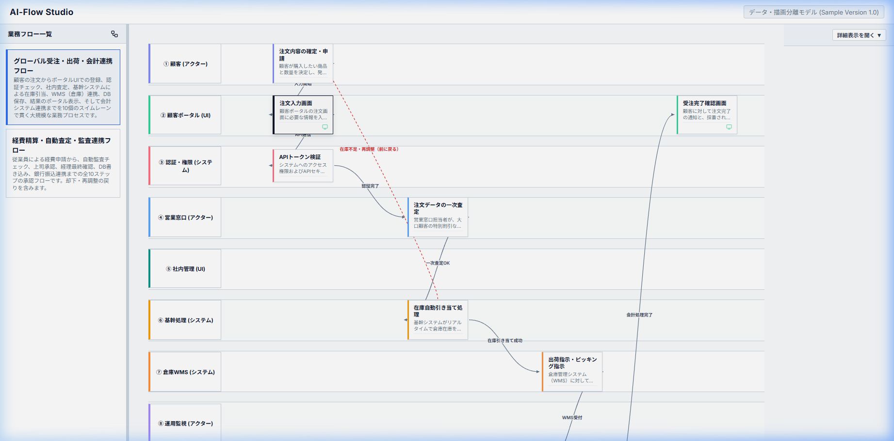
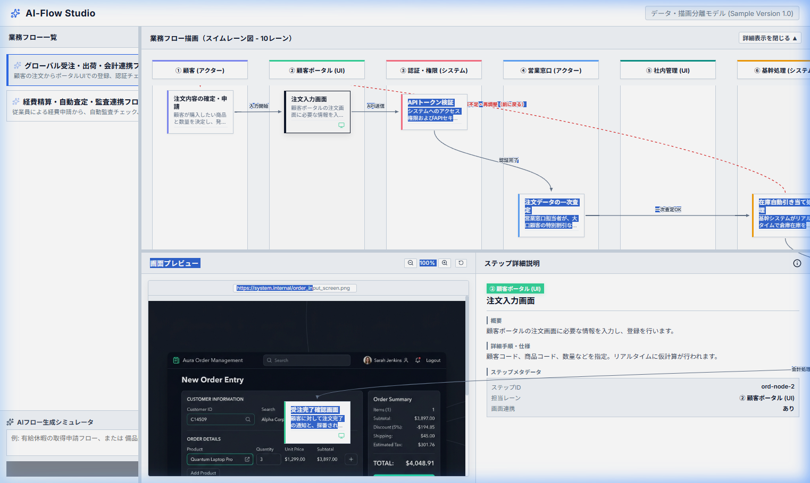

# AI-Flow Studio (業務フロー・画面プレビュー描画システム)

AI-Flow Studio は、**「データと描画の完全分離モデル」** に基づいて構築された、超軽量かつ直感的な業務プロセス描画 ＆ 画面プレビュー管理アプリケーションです。  
美麗なグラデーションと洗練されたダークテーマ（ガラスモルフィズム風デザイン）を採用し、軽快な操作性と高い視認性を実現しています。

---

## 📸 アプリケーションの外観とUI構成

### 1. メインダッシュボード (初期レイアウト)
アプリを開くと、左側にフローとバージョンの選択サイドバー、右側にスイムレーンフローチャートが表示されます。
各ペインの境界はマウスドラッグでリアルタイムにサイズ調節可能です。



### 2. ノード詳細 ＆ 画面プレビュー (インタラクティブ状態)
フロー内のノード（業務プロセス）をクリックすると、画面下部に「画面プレビュー（左）」と「詳細仕様・検討メモ（右）」が自動的に展開されます。



---

## 🚀 主な特徴と機能

### 1. データ・描画分離型 業務フロー
* **スイムレーン対応**: 各アクターやシステム（レーン）に処理ノードを分類配置。
* **条件分岐 ＆ 決定ループ**: ひし形の条件分岐ノードから複数の方向へ矢印を接続し、複雑な条件分岐プロセスを美しく可視化。
* **対話的なレイアウト調整**: フローチャート全体の拡大縮小（ズーム）、マウスドラッグによる自由な移動（パンニング）に対応。

### 2. 画面プレビュー ＋ 過去画像履歴管理 (バージョン独立)
* **100%全面表示**: 各ノードに設定された画面イメージを大画面でプレビュー。
* **画像履歴（バージョン管理）**: 各ノードに対して過去の画面履歴を保持し、ヘッダーの履歴切り替えプルダウンからいつでも過去の画面を全面プレビュー可能。
* **独立したバージョン管理**: フローIDが同じであっても、バージョン（例: `v1.0` と `v1.1`）が異なれば、画像やメモの変更内容は完全に独立して保持されます。他バージョンに影響を与える心配はありません。

### 3. 物理ファイル保存 ＆ クリーンアップ (GC) 連携
* **物理アセット保存化**:
  アップロードされた画像は Base64 のまま JSON ファイルに埋め込むのではなく、Vite サーバー側の API を介して自動的に `public/images/` に物理画像ファイル（例: `credit-card-flow_card-node-2_1786190447166.png`）として書き出されます。これにより、フロー状態の JSON ファイルが肥大化するのを防ぎます。
* **未使用アセット自動削除 (GC)**:
  フロー更新（保存）の際、最新 of flowデータ（および画像履歴）のどこからも参照されなくなった画像ファイルを自動検知し、物理フォルダから自動的に消去（Garbage Collection）します。不要なアセットファイルがサーバーに残ることはありません。

### 4. 検討用メモの追加・削除
* 各ノードごとに、業務設計の確認事項や改善要望を付箋感覚で簡単に追加・削除できます。追加したメモは日付とともに JSON ファイルへ自動的に永続化されます。

### 5. 自己再生成型 ポータブルHTMLダウンロード
* **1ファイルの極小パッケージ**:
  すべてのスタイル、アイコン、Reactアプリコード、そしてフローデータ自体を1枚の HTML ファイルにバンドルしてダウンロードできます。
* **ポータブル版単体での自己再生成**:
  ローカルサーバーがない環境（ファイルプロトコルで直接HTMLを開いている状態）であっても、画面上で追加したメモや画像を埋め込んだ状態で「HTMLダウンロード」を実行すると、**最新の編集内容を内包した新しいHTMLをその場で自己再生成してダウンロード**できます。

---

## 🛠️ セットアップと起動方法

### ローカル開発環境の起動
Node.js 環境にて以下のコマンドを実行します。

1. **パッケージのインストール**:
   ```bash
   npm install
   ```

2. **開発サーバーの起動**:
   ```bash
   npm run dev
   ```
   ブラウザで `http://localhost:5173` にアクセスします。

3. **本番用ビルド**:
   ```bash
   npm run build
   ```

---

## 📁 データ構造仕様 (データ・描画分離モデル)

本システムでは、描画ロジック（座標計算やDOM生成）は一切データに含めず、純粋な状態定義 JSON（例: `src/data/creditCardFlow.json`）を読み込んで描画を行っています。

### 1. 全体スキーマ (Root)

フロー定義のルートオブジェクトの仕様です。

| プロパティ | 型 | 必須 | 説明 |
| :--- | :--- | :--- | :--- |
| `id` | `string` | 必須 | フローの一意の識別子。保存ファイル名特定にも使用されます。 |
| `ver` | `string` | 任意 | フローのバージョン（例: `"1.0"`, `"1.1"`）。デフォルトは `"1.0"`。 |
| `title` | `string` | 必須 | フローの名称。ヘッダーおよびサイドバーに表示されます。 |
| `description` | `string` | 任意 | フローの概要・解説文。 |
| `swimlanes` | `Array<Swimlane>` | 必須 | スイムレーン（レーン）の定義オブジェクトリスト。 |
| `nodes` | `Array<Node>` | 必須 | フロー内の全ノード（処理ステップ・画面・判断分岐）のリスト。 |
| `edges` | `Array<Edge>` | 必須 | ノード間の接続関係（矢印）のリスト。 |

---

### 2. スイムレーン定義 (`Swimlane`)

アクターやシステム、UI画面といった担当領域をレーンとして定義します。

```typescript
interface Swimlane {
  id: string;            // レーンの一意のID
  name: string;          // レーンの表示名（例: "① 顧客", "② 顧客ポータル"）
  color: string;         // レーンのテーマカラー（HEX値。ヘッダーや枠線のボーダー等に適用されます）
  isImageLane?: boolean; // 画面UIレーンかどうかのフラグ（trueの場合、ノード詳細表示で画面プレビュー枠が優先表示されます）
}
```

---

### 3. ノード定義 (`Node`)

業務フロー内の処理ノード、画面ノード、分岐条件などを定義します。

```typescript
interface Node {
  id: string;              // ノードの一意のID
  laneId: string;          // 所属するスイムレーン(Swimlane)のID
  row: number;             // プロセスの左右の列ステップ（Column / X座標）を表す1以上の整数値。手順順に数値を増やします。
  title: string;           // ノードのタイトル
  description?: string;    // ノードの概要・説明文
  details?: string;        // 業務の詳細仕様やバリデーション規則
  type?: 'decision';       // ノードタイプ。'decision' の場合はひし形（分岐）として描画されます
  image?: string;          // 画面アセットの相対パス (例: "images/uploaded_xx.png")
  imageHistory?: Array<{   // 過去の画面変更履歴のリスト (バージョン独立)
    url: string;           // 過去の画像パス
    date: string;          // 更新日時 (例: "8/8 21:02 に更新")
  }>;
  memos?: Array<{          // 検討・確認メモのリスト
    id: string;            // メモの一意のID (タイムスタンプなど)
    text: string;          // メモのテキスト本文
    date: string;          // メモが追加された日時 (例: "8/8 21:02")
  }>;
}
```

---

### 4. エッジ定義 (`Edge`)

ノードとノードを繋ぐフローの遷移矢印を定義します。

```typescript
interface Edge {
  from: string;            // 接続元ノードのID
  to: string;              // 接続先ノードのID
  label?: string;          // 矢印線上に表示する分岐ラベル（例: "YES", "NO"）
}
```

---

### フロー定義 JSON のサンプル
```json
{
  "id": "credit-card-flow",
  "ver": "1.0",
  "title": "クレジットカード入会審査・発行フロー",
  "description": "自動審査スコアリングチェックから3方向に判断分岐する10レーン業務プロセス。",
  "swimlanes": [
    { "id": "customer", "name": "① 顧客", "color": "#818cf8" },
    { "id": "portal", "name": "② 顧客ポータル", "color": "#34d399", "isImageLane": true }
  ],
  "nodes": [
    {
      "id": "card-node-2",
      "laneId": "portal",
      "row": 1,
      "title": "入会フォーム入力画面",
      "image": "images/order_input_screen.png",
      "details": "入力データの即時バリデーションが行われます。",
      "memos": [
        { "id": "1786190565441", "text": "初期表示での入力欄フォーカス制御について確認", "date": "8/8 21:02" }
      ]
    }
  ],
  "edges": [
    { "from": "card-node-1", "to": "card-node-2", "label": "遷移" }
  ]
}
```

---

## 🤖 LLM（AI）によるフローデータの生成・編集

フローデータをミーティングの議事録から生成したり、自然言語で修正したりするための LLM 専用システムプロンプトを用意しています。コピペして ChatGPT や Gemini などの生成 AI に渡すだけで、誰でも簡単に正確なフローデータを作成・修正できます。

### 1. 議事録からフローJSONを新規作成する
フロー設計に関するミーティングの議事録やテキストメモから、構造化されたフローJSONを自動生成します。スイムレーン内の縦位置（`row`）は、並行処理や重なりを避ける必要がある場合を除き、極力 `row: 1`（横一直線）に並べて無駄な余白を省くよう制約が組み込まれています。
👉 **[generate_flow_json.md (新規生成用プロンプト)](docs/prompts/generate_flow_json.md)**

### 2. 既存のJSONを自然言語で編集・修正する
「〇〇の処理ノードを一段下に下げて」「〇〇のレーンにノードを追加して、自動スコアリングから矢印を繋いで」といった日本語の指示から、既存のJSONをスマートに更新します。主に `row`（配置行）の高さ調整や矢印（`edges`）の繋ぎ替え指示に最適化されています。
👉 **[edit_flow_json.md (編集・修正用プロンプト)](docs/prompts/edit_flow_json.md)**
